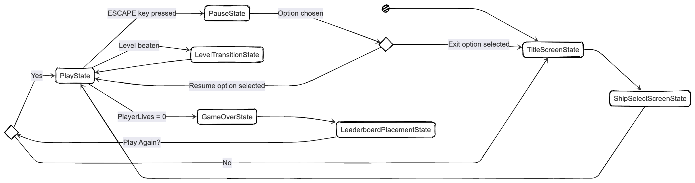
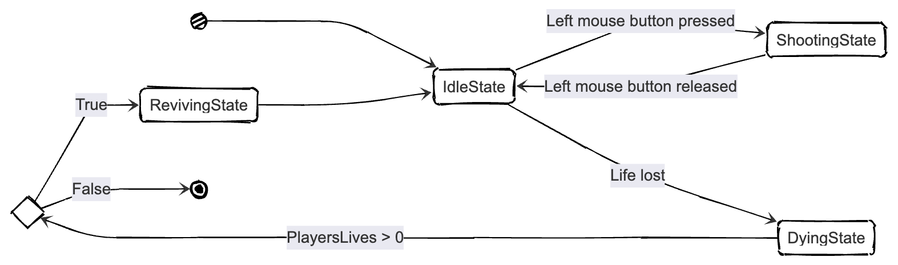
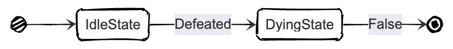
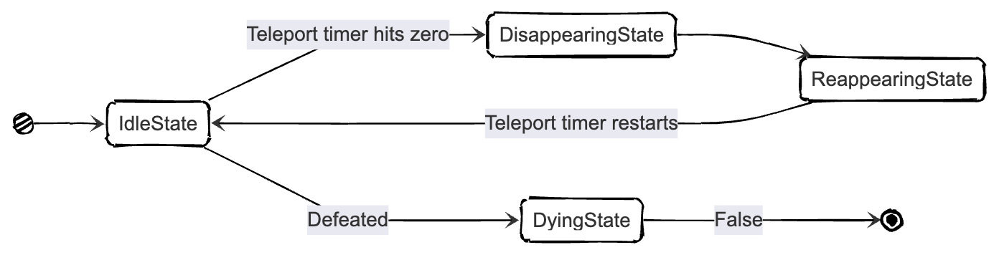
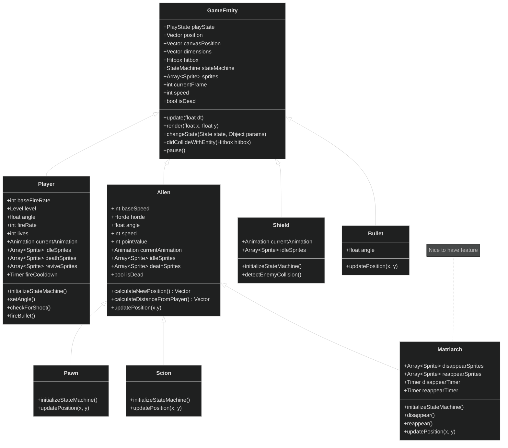
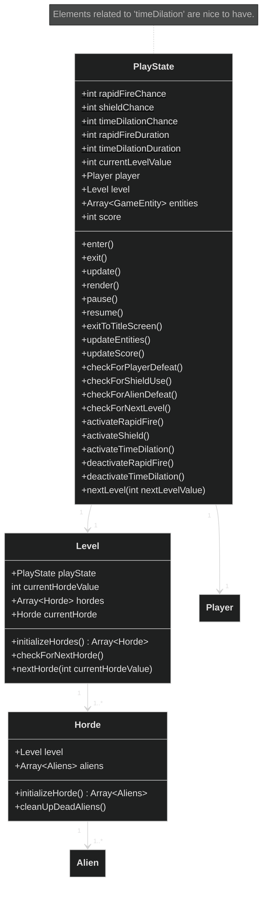
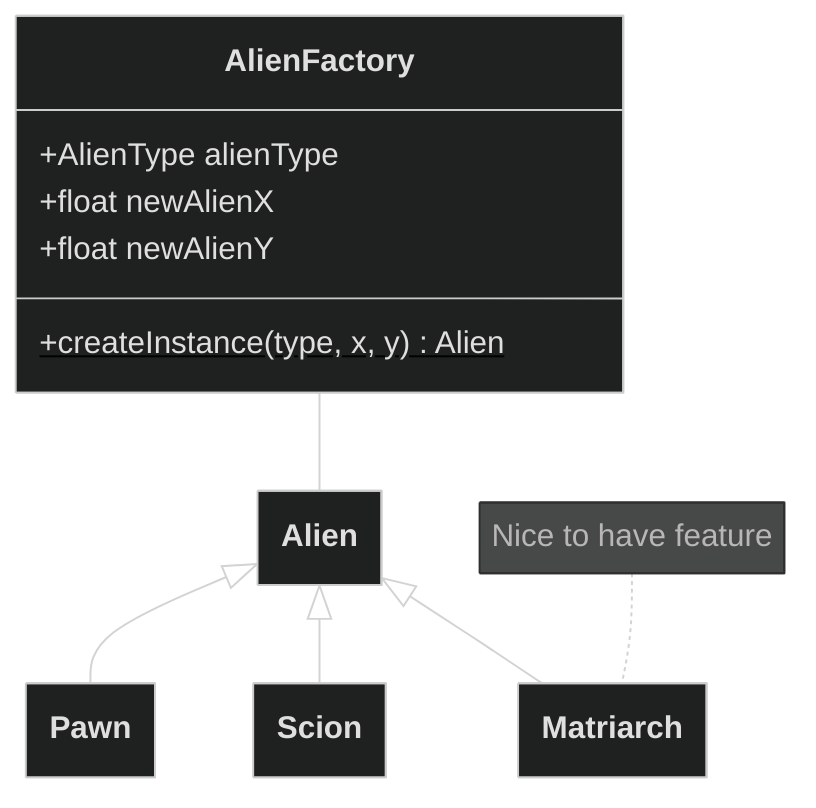
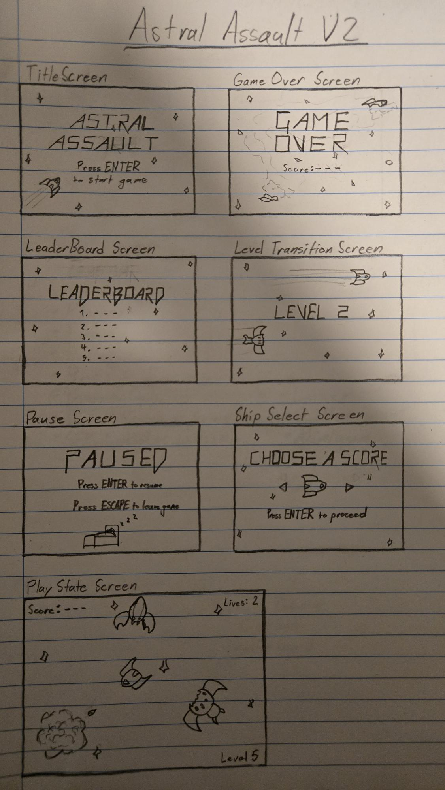

# Final Project

- [x] Read the [project requirements](https://vikramsinghmtl.github.io/420-5P6-Game-Programming/project/requirements).
- [x] Replace the sample proposal below with the one for your game idea.
- [ ] Get the proposal greenlit by Vik.
- [ ] Place any assets in `assets/` and remember to update `src/config.json`.
- [ ] Decide on a height and width inside `src/globals.js`. The height and width will most likely be determined based on the size of the assets you find.
- [ ] Start building the individual components of your game, constantly referring to the proposal you wrote to keep yourself on track.
- [ ] Good luck, you got this!

---

# Proposal - Astral Assault

> [!note]
> This proposal, while it will have a section dedicated to various nice-to-haves, does not demonstrate through alternative diagrams of how they will be implemented. It will however describe how they may be implemented.

## ✒️ Description

In this interstellar shoot 'em up game, players take on the role of a pilot and their ship having to eternally survive through hordes upon hordes of alien enemies until they themselves are defeated. Players will control a stationary ship at the center of their screa, and aim to fire at and destroy various incoming aliens. _Astral Assault_ is a level-based game, with the player having to face more hordes for each level the further they progress. There is no present win condition, only the goal to simply survive for as long as possible and get as high of a score as possible.

## 🕹️ Gameplay

Players begin a game session with a starting total of three lives, in which losing all of them means losing the game. Their ship is fixed to the center of the screen with the only available range of movement is rotations, in which the front of the ship will always face the player's mouse cursor.

For each level (starting at 1), players will face a series of alien hordes/waves equal to the number value of the current level itself. The aliens themselves spawn from the edge of the screen and are set to continuously approach the player's ship until they're either fired at and destroyed (in one-hit) or make contact with the player in which the player's ship is destroyed, the game pauses, and they lose one life before the game resumes. As the game continues to progress into higher levels, new types of aliens as well as larger numbers of them will begin to appear, forcing the diffculty to continuously increase until it most-likely becomes impossible for any normal person to continue surviving.

There will be three types of aliens that can appear throughout a play session, each with different AIs in the forms of their movement patterns:

- Pawn: Pawns are simple aliens that will always move in a straight line towards the player.
- Scion: Scions are aliens that slowly circle around the ship as they spawn, however their speed increases the closer they get (which caps out at a certain distance from the player).

In addition, there is a chance that upon an alien's defeat that the player gains one of the following power-ups (in which only one can be active at a time):

- Rapid Fire: The player's fire-rate is temporily doubled for 5 seconds. Has a 5% chance of being obtained when an alien is defeated.
- Shield: The player can be shielded from enemy contact once without losing a life. Has a 2% chance of being obtained when an alien is defeated.

This implementation of _Astral Assault_ is a single player experience with an AI. The game is played primarily with the mouse to interact with the cards and general GUI. The players can optionally hit `P` on their keyboard to pause the game.

## 📃 Requirements

1. Start a game session by pressing 'ENTER'.
2. Choosing a desired ship sprite before the game itself begins (purely cosmetic, similar to what was seen in the Breakout lectures).
3. Start the game at level 1 with three lives.
4. See their ship at the center of the screen.
5. Aiming their ship by moving their mouse cursor around.
6. See incoming aliens in their various types.
7. Firing projectiles at aliens by aiming and clicking their left mouse button.
8. Progress to the next horde if all aliens within the current one are destroyed.
9. Progress to the next level if all hordes within the current one are cleared.
10. Acquire different power ups during the game upon defeating enemies.
11. View their current score as they progress.
12. Pause the game by pressing 'ESCAPE'.
13. Option to resume game in pause state.
14. Option to exit game in pause state.
15. Lose a life if an alien makes contact with the player's ship.
16. Lose the game if the player loses all three of their lives.
17. View the placement of their end-game score one a 10-person leader board.
18. Have the option to choose to play again, beginning a new game if yes and returning to the title screen if no.

### 🤖 State Diagrams

Game State Diagram

Player State Diagram

Enemy State Diagram

Matriach State Diagram

### 🗺️ Class Diagram

### GameEntity Class Inheritance Diagram

### PlayState Class Composition Diagram

### EnemyFactory Class Diagram

### 🧵 Wireframes

### 🎨 Assets

I drew the wireframes myself on pencil and paper. Wireframes are the equivalent to the skeleton of a web app since they are used to describe the functionality of the product and the users experience.

The GUI will be kept simple yet visually appealing, as to make sure the game is easy to understand, what each component does and is, as well actually make for an enjoyable game.

#### 🖼️ Images

- [Spaceship](./assets/sprites/ship-sprites/spaceships.png) and [projectile](./assets/sprites/ship-sprites/projectiles.png) assets taken from Lowich's [Spaceship sprites](https://lowich.itch.io/free-spaceship-sprites?download) asset pack on Itch.io. Lowrich also included a downloadable [license](./assets/licenses/lowich_license.txt).
- [Orange](./assets/sprites/explosion-sprites/Fire%20Effect%20and%20Bullet%2016x16.png) and [Blue](./assets/sprites/explosion-sprites/Water%20Effect%20and%20Bullet%2016x16.png) effect assets taken from BDragon1727's [Free Effect and Bullet 16x16](https://bdragon1727.itch.io/free-effect-and-bullet-16x16) asset pack on Itch.io.
- [Alien](./assets/sprites/aliens/) assets designed by me using [Piskel](https://www.piskelapp.com/).

#### ✏️ Fonts

- [Vermin Vibes 1989](https://www.dafont.com/vermin-vibes-1989.font) will be used for the title screen's primary label, a sharp and retro look for the arcade-style game I am attempting to make.
- [Pixellari](https://www.dafont.com/pixellari.font) a simple and legible pixelized font that will be used for all other implementations of text.

#### 🔊 Sounds

All sounds were created and downloaded from [jsfxr](https://sfxr.me/) for the following sound effects (subject to change):

- [playerShoot](./assets/sounds/playerShoot.wav)
- [playerDeath](./assets/sounds/playerDeath.wav)
- [enemyDeath](./assets/sounds/enemyDeath.wav)
- [nextLevel](./assets/sounds/nextLevel.wav)
- [nextHorde](./assets/sounds/nextHorde.wav)
- [rapidFire](./assets/sounds/rapidFire.wav)
- [shield](./assets/sounds/shield.wav)
- [timeDilation](./assets/sounds/timeDilation.wav)

Music to be added.

## Nice to Have Features

### Minor: Third Alien - Matriarch

Matriarchs are the most difficult alien to destroy as after a certain period of time they will teleport to a random area on the screen. They are normally invincible but have a specific time-window before and after their next teleportation where they are vulnerable to attack. Its invincible state is depicted as a repeated flashing from transparent to opaque, which otherwise isn't present when it's vulnerable.

### Minor: Third Power-Up - Time Dilation

Time appears to slow down for 5 seconds, with enemy and player-bullet speeds decreasing to 25% of their original value. Has a 0.5% chance of being obtained when an alien is defeated.

### Major: Boss Fight

A special boss fight would be added to occur at every 5th level, where the playstyle suddenly changes to mimic _Space Invaders_ as you fight against a much larger alien with various attacks and its own health pool.

### Major: More Custom Art

More assets for things like the ships, general effects, etc, would be personally illustrated rather than taken from third-party sources and other artists.

### Wait what?: Custom Music

The music would be personally composed rather than taken from third-party sources and other artists.

### Even More Stuff

I don't know. There might be more stuff, or less stuff, or different stuff. We'll cross that bridge when we get there.
